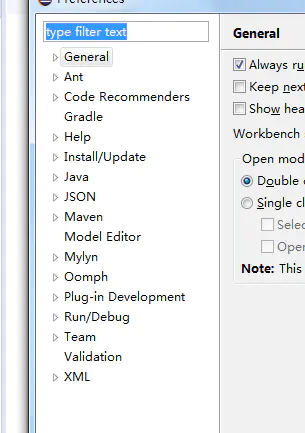
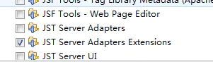
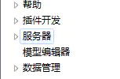

# Eclipse配置Tomcat时找不到Server选项的解决方案

最近换了机器，需要重新安装`Eclipse`，在官网下载了`photon`版本发现最新的版本是没有办法直接配置`Tomcat`的。

**解决方案**

# 1. 安装新软件功能
使用安装新软件功能并填写如下内容，如果你不知道该如何安装新软件，请查看我之前一篇关于汉化`Eclipse`的教程。

> Name："Kepler" repository  
> location：[http://download.eclipse.org/releases/kepler](http://download.eclipse.org/releases/kepler)

](images/screenshot_1587863826470.png)

# 2.下载对应扩展
勾选`Web,XML, Java EE and OSGi Enterprise Development`里的`JST Server AdaptersExtensions`

之后一路向下安装即可。

PS：不要吐槽为什么突然变成中文了……写文章的时候顺便做了一下汉化。