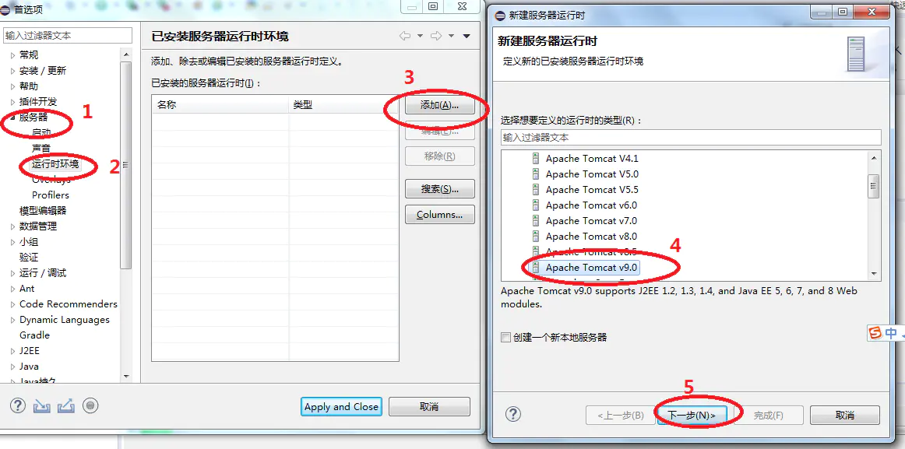
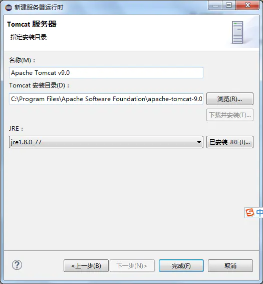

# 在Eclipse中配置Tomcat

在开始学习`Servlet`和`JSP`之前需要先配置`Tomcat`。

**步骤如下：**

1. 打开窗口 → 首选项（需要汉化的话查请查看我之前的垃圾教程）

2. 选择服务器 → 运行时环境 → 添加 → Apache → 对应的`Tomcat`版本
如果没有找到服务器`/sever`，请查看后面一篇的教程

3.  选择`Tomcat`的安装目录并选择安装的`JDK`版本

单击完成即可。