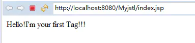

**目录**
[toc]

# 1.编写标签需要用到的类
该类继承自TagSupport类，需要重写doStartTag方法
~~~java
package com.yuchi.Tag;

import java.io.IOException;
import java.io.PrintWriter;

import javax.servlet.jsp.JspException;
import javax.servlet.jsp.tagext.TagSupport;

public class MyFirstTag extends TagSupport {

    @Override
    public int doStartTag() throws JspException {
        try {
            pageContext.getOut().print("Hello!I'm your first Tag!!!");
        } catch (IOException e) {
            // TODO Auto-generated catch block
            e.printStackTrace();
        }
        return super.doStartTag();
    }
    
}
~~~

# 2.配置tld文件【web-inf下】
~~~xml
<?xml version="1.0" encoding="UTF-8"?>
<taglib xmlns="http://java.sun.com/xml/ns/j2ee"
    xmlns:xsi="http://www.w3.org/2001/XMLSchema-instance"
    xsi:schemaLocation="http://java.sun.com/xml/ns/j2ee http://java.sun.com/xml/ns/j2ee/web-jsptaglibrary_2_0.xsd"
    version="2.0">
    <description>A tag library exercising SimpleTag handlers.</description>
    <tlib-version>1.0</tlib-version>
    <short-name>SimpleTagLibrary</short-name>
    <uri>FirstTag</uri>
    <tag>
        <name>firstTag</name>
        <tag-class>com.yuchi.Tag.MyFirstTag</tag-class>
        <body-content>empty</body-content>
    </tag>
</taglib>
~~~

其中uri标签指定了一个访问的名称，在页面导入的时候需要使用到。name则是指定的标签名字，tag-class指定标签要用的类路径。

保存后需要构建文件路径

# 3.页面导入

~~~xml
...
<%@ taglib prefix="yuchi" uri="FirstTag" %>
...
<yuchi:firstTag/>
~~~

# 4.大功告成

# 5.你以为这就完了？

**TIP：如果修改了类文件和tld文件。请务必：**
**重新导入构建tld文件！**
**重新导入构建tld文件！**
**重新导入构建tld文件！**
要不然就等着和我一样改啥都没反应吧T\_T