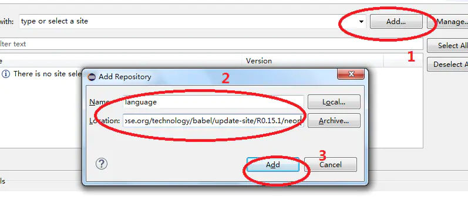

# Eclipse汉化

对于初学者来说，其实汉化还是挺有必要的，想当初我看到一屏幕的英文也是一脸蒙蔽，极度影响了写代码的积极性。

# 1. 获取汉化需要的链接
该链接从[eclipse官网相关页面](http://www.eclipse.org/babel/downloads.php)即可获取

~~如果你实在懒到了点都懒得点的地步，就复制下面的链接吧，注意选择对应版本。~~
> 1.oxygen版本  
> [http://download.eclipse.org/technology/babel/update-site/R0.15.1/oxygen](http://download.eclipse.org/technology/babel/update-site/R0.15.1/oxygen)  
> 2.neon版本  
> [http://download.eclipse.org/technology/babel/update-site/R0.15.1/neon](http://download.eclipse.org/technology/babel/update-site/R0.15.1/neon)  
> 3.mars版本  
> [http://download.eclipse.org/technology/babel/update-site/R0.15.1/mars](http://download.eclipse.org/technology/babel/update-site/R0.15.1/mars)

# 2. 下载官方汉化包
打开软件，`Help → InstallNew Software → Add`。

在`Name`输入框中输入`language`，`Location`栏中填入第一步获取的链接，单击`OK`。

可以看到软件正在读条获取文件列表，过低的版本可能不会显示读条，请稍作等待至出现如下界面。

下拉勾选`chinese（simplified）`后点击`next`后，勾选`I agree with……`并等待安装即可。

中途会弹出是否立即安装和是否重启软件，点击同意便可完成汉化。